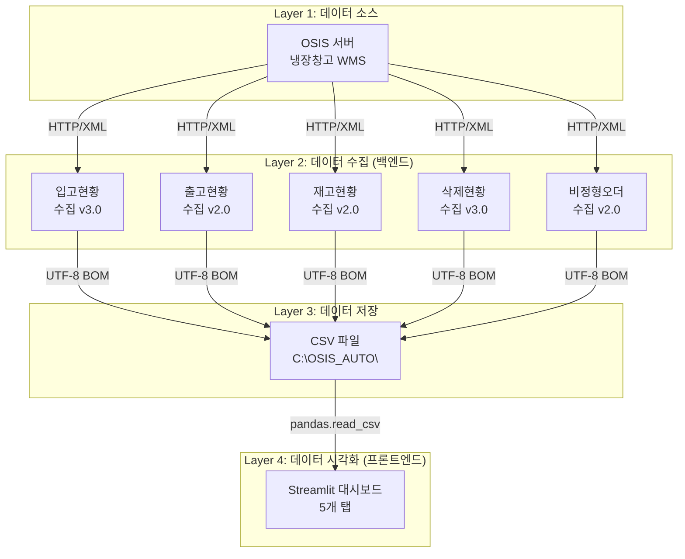
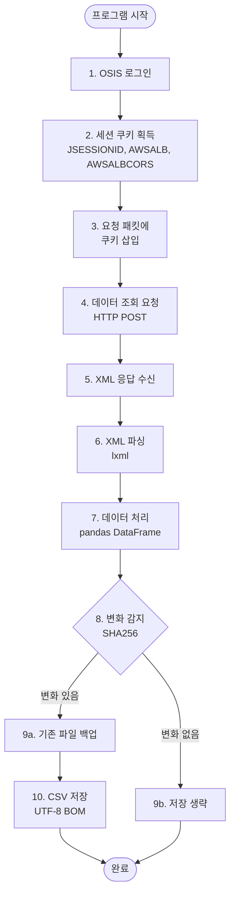
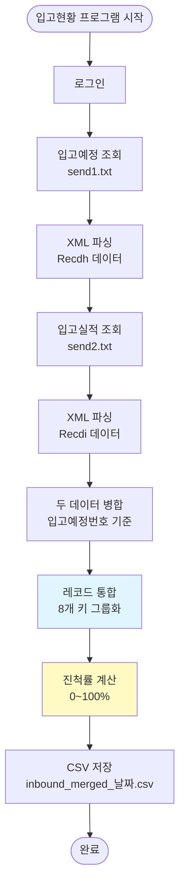
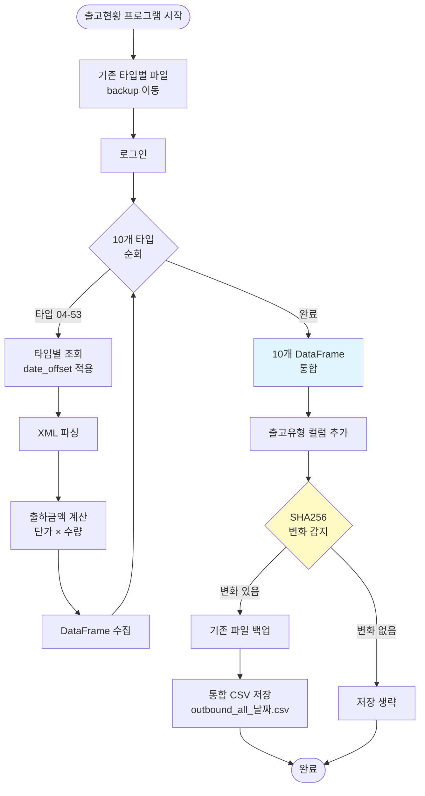
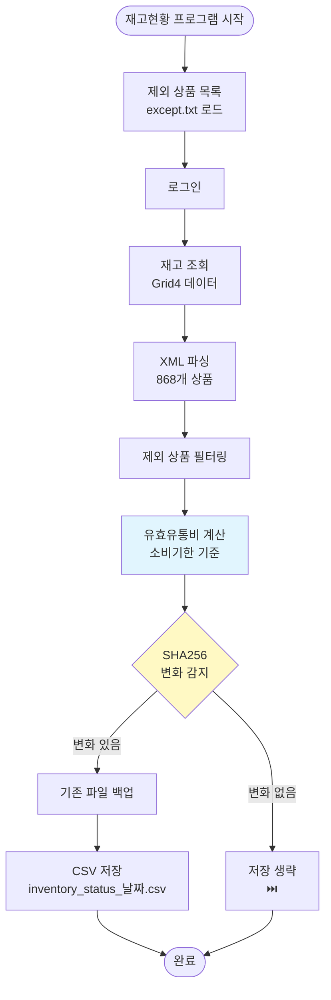
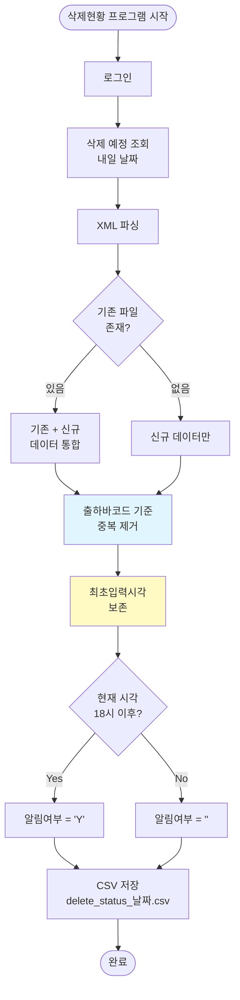
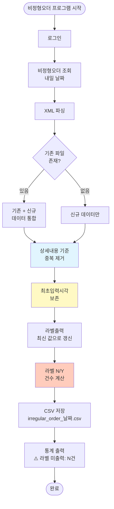
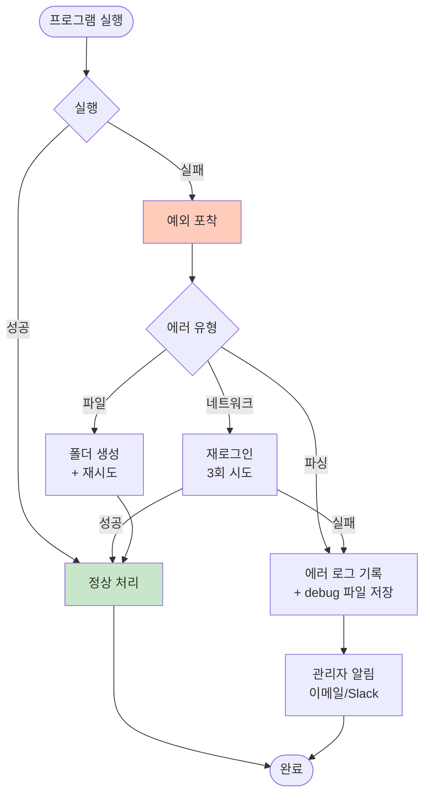
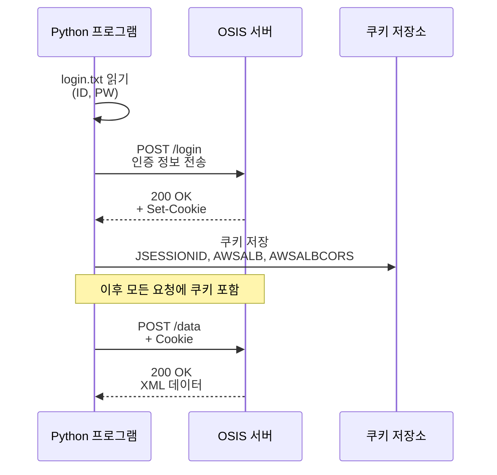

# 🔄 WMS 대시보드 시스템 흐름도

**버전**: v1.0  
**최종 업데이트**: 2025-10-30  
**작성자**: WMS 개발팀

---

## 📑 목차

1. [전체 시스템 아키텍처](#전체-시스템-아키텍처)
2. [데이터 수집 흐름](#데이터-수집-흐름)
3. [백엔드 5개 모듈 상세](#백엔드-5개-모듈-상세)
4. [변화 감지 시스템](#변화-감지-시스템)
5. [대시보드 시각화 프로세스](#대시보드-시각화-프로세스)

---

## 🏗️ 전체 시스템 아키텍처

### 시스템 구성도

```
┌─────────────────────────────────────────────────────────────┐
│                     WMS 대시보드 시스템                      │
└─────────────────────────────────────────────────────────────┘

┌──────────────────┐     ┌──────────────────┐     ┌──────────────────┐
│                  │     │                  │     │                  │
│   OSIS 서버      │────▶│  백엔드 수집     │────▶│  프론트엔드      │
│   (데이터 원천)  │     │  (Python)        │     │  (Streamlit)     │
│                  │     │                  │     │                  │
└──────────────────┘     └──────────────────┘     └──────────────────┘
        │                         │                         │
        │                         │                         │
        ▼                         ▼                         ▼
  - 입고 데이터            - CSV 파일 생성            - 웹 대시보드
  - 출고 데이터            - 자동 백업                - 실시간 모니터링
  - 재고 데이터            - 변화 감지                - 데이터 시각화
  - 삭제 데이터            - 스케줄 실행              - 알림 기능
  - 비정형오더
```

---

### 3계층 아키텍처



---

## 📊 데이터 수집 흐름

### 전체 수집 프로세스



---

### 공통 처리 단계

**모든 모듈이 공유하는 5단계 프로세스:**


```
┌────────────────────────────────────────────────────────────────┐
│ 1단계: 인증 (Authentication)                                   │
│    - OSIS 서버 로그인                                          │
│    - 세션 쿠키 획득                                            │
└────────────────────────────────────────────────────────────────┘
                              ↓
┌────────────────────────────────────────────────────────────────┐
│ 2단계: 요청 (Request)                                          │
│    - 요청 템플릿 로드 (txt 파일)                               │
│    - 쿠키 삽입                                                 │
│    - 날짜 플레이스홀더 치환                                    │
└────────────────────────────────────────────────────────────────┘
                              ↓
┌────────────────────────────────────────────────────────────────┐
│ 3단계: 응답 (Response)                                         │
│    - XML 데이터 수신                                           │
│    - lxml로 파싱                                               │
│    - DataFrame 변환                                            │
└────────────────────────────────────────────────────────────────┘
                              ↓
┌────────────────────────────────────────────────────────────────┐
│ 4단계: 처리 (Processing)                                       │
│    - 데이터 정제                                               │
│    - 계산 필드 추가 (진척률, 유효유통비, 출하금액 등)          │
│    - 제외 상품 필터링                                          │
└────────────────────────────────────────────────────────────────┘
                              ↓
┌────────────────────────────────────────────────────────────────┐
│ 5단계: 저장 (Storage)                                          │
│    - 변화 감지 (SHA256)                                        │
│    - 백업 생성 (변경 시)                                       │
│    - CSV 저장 (UTF-8 BOM)                                      │
└────────────────────────────────────────────────────────────────┘
```

---

## 🔧 백엔드 5개 모듈 상세

### 1. 입고현황 수집 (v3.0)



**핵심 특징**:
- ✅ 두 번의 조회 (입고예정 + 입고실적)
- ✅ 레코드 통합으로 중복 제거
- ✅ 진척률 자동 계산

---

### 2. 출고현황 수집 (v2.0)



**핵심 특징**:
- ✅ 10개 타입 → 1개 파일 통합
- ✅ 변화 감지로 불필요한 저장 방지
- ✅ 성능 94% 향상 (80초 → 4.6초)

---

### 3. 재고현황 수집 (v2.0)



**핵심 특징**:
- ✅ 유효유통비 자동 계산
- ✅ 스마트 저장 (변화 시만)
- ✅ 디스크 I/O 50~70% 감소

---

### 4. 삭제현황 수집 (v3.0)



**핵심 특징**:
- ✅ 누적 방식 (당일 데이터 유지)
- ✅ 18시 이후 자동 알림
- ✅ 최초입력시각 자동 보존

---

### 5. 비정형오더 수집 (v2.0)



**핵심 특징**:
- ✅ 실시간 모니터링 (1분 주기)
- ✅ 라벨 N→Y 변경 추적
- ✅ 최초입력시각 보존

---


### 에러 처리 흐름



---

## 📁 파일 시스템 구조

### 백엔드 파일 구조

```
C:\OSIS_AUTO\
│
├── Inbound Status\
│   ├── inbound_status.py
│   ├── inbound_merged_20251030.csv         ← 최신 데이터
│   ├── send1.txt                           ← 입고예정 템플릿
│   ├── send2.txt                           ← 입고실적 템플릿
│   ├── except.csv                          ← 제외 상품
│   └── backup/
│       └── inbound_merged_20251029.csv
│
├── Outbound Status\
│   ├── collect_outbound_status.py
│   ├── outbound_all_20251030.csv           ← 최신 통합 파일
│   ├── outbound_all_20251030.csv.hash      ← SHA256 해시
│   ├── login.txt
│   ├── outbound_request_template.txt
│   ├── except.csv
│   └── backup/
│       ├── outbound_all_20251030_080532.csv
│       ├── outbound_04_20251029.csv        ← 구버전 타입별
│       ├── outbound_05_20251029.csv
│       └── ...
│
├── inventory_status\
│   ├── inventory_status.py
│   ├── inventory_status_20251030.csv       ← 최신 데이터
│   ├── inventory_status_20251030.csv.hash  ← SHA256 해시
│   ├── login.txt
│   ├── test.txt
│   ├── except.txt
│   ├── 기본로케이션.csv
│   └── backup/
│       └── inventory_status_20251030_140532.csv
│
├── Delete Status\
│   ├── delete_status.py
│   ├── delete_status_20251030.csv          ← 누적 데이터
│   ├── login.txt
│   ├── test.txt
│   └── backup/
│       └── delete_status_20251029.csv
│
└── IrregularOrder Status\
    ├── irregular_order_status.py
    ├── irregular_order_20251030.csv        ← 누적 데이터
    ├── login.txt
    ├── test.txt
    └── backup/
        └── irregular_order_20251029.csv
```

---

### 프론트엔드 파일 구조

```
C:\Projects\WMS-DashBoard\
│
└── dashboard\
    ├── app.py                              ← 메인 앱
    │
    ├── src\
    │   ├── data\
    │   │   └── collectors\
    │   │       ├── base.py                 ← 추상 클래스
    │   │       ├── inbound.py              ← 입고 수집기
    │   │       ├── outbound.py             ← 출고 수집기
    │   │       ├── inventory.py            ← 재고 수집기
    │   │       ├── delete.py               ← 삭제 수집기
    │   │       └── irregular.py            ← 비정형 수집기
    │   │
    │   └── ui\
    │       └── components.py               ← UI 컴포넌트
    │
    └── tests\
        └── fixtures\                       ← 샘플 데이터
            ├── sample_inbound.csv
            ├── sample_outbound.csv
            ├── sample_inventory.csv
            ├── sample_delete.csv
            └── sample_irregular.csv
```

---

## 🔐 보안 및 인증

### 로그인 프로세스



---

### 쿠키 관리

**필수 쿠키 3개:**
1. **JSESSIONID**: 세션 식별자
2. **AWSALB**: AWS 로드 밸런서
3. **AWSALBCORS**: CORS 처리

**쿠키 유효 기간**: 세션 단위 (로그아웃 또는 타임아웃)

---

## 📊 데이터 흐름 요약

### 입력 → 처리 → 출력

```
┌─────────────────────────────────────────────────────────────┐
│ INPUT (입력)                                                │
├─────────────────────────────────────────────────────────────┤
│ • OSIS 서버 XML 데이터                                      │
│ • 로그인 정보 (txt)                                         │
│ • 요청 템플릿 (txt)                                         │
│ • 제외 상품 목록 (csv/txt)                                  │
└─────────────────────────────────────────────────────────────┘
                            ↓
┌─────────────────────────────────────────────────────────────┐
│ PROCESSING (처리)                                           │
├─────────────────────────────────────────────────────────────┤
│ • 인증 및 세션 관리                                         │
│ • XML 파싱 (lxml)                                           │
│ • DataFrame 변환 (pandas)                                   │
│ • 데이터 정제 및 계산                                       │
│ • 변화 감지 (SHA256)                                        │
│ • 백업 생성                                                 │
└─────────────────────────────────────────────────────────────┘
                            ↓
┌─────────────────────────────────────────────────────────────┐
│ OUTPUT (출력)                                               │
├─────────────────────────────────────────────────────────────┤
│ • CSV 파일 (UTF-8 BOM)                                      │
│ • 해시 파일 (.hash)                                         │
│ • 백업 파일 (backup/)                                       │
│ • 콘솔 로그                                                 │
│ • Streamlit 대시보드                                        │
└─────────────────────────────────────────────────────────────┘
```

---

## 📈 성능 최적화 포인트

### 1. 변화 감지로 I/O 감소

**AS-IS (기존)**:
```
매 실행마다 파일 저장 → 불필요한 디스크 쓰기
```

**TO-BE (개선)**:
```
변화 감지 → 동일 데이터는 저장 생략 → I/O 70% 감소
```

---

### 2. 통합 파일로 로딩 속도 향상

**AS-IS (출고 v1.0)**:
```
10개 파일 개별 읽기 → 10회 I/O → 느림
```

**TO-BE (출고 v2.0)**:
```
1개 통합 파일 읽기 → 1회 I/O → 90% 빠름
```

---

### 3. 레코드 통합으로 데이터 정확도 향상

**AS-IS (입고 v2.0)**:
```
중복 레코드 → 부정확한 진척률 → 사용자 혼란
```

**TO-BE (입고 v3.0)**:
```
8개 키로 통합 → 정확한 진척률 (0~100%) → 신뢰도 향상
```

---

## 📚 참고 문서

### 관련 문서 링크

- **PROJECT_STATUS.md**: 프로젝트 진행 상황
- **02_기술설명서.md**: 기술 아키텍처 상세
- **04_전체개발계획서.md**: 개발 계획 및 일정

### 기술 가이드

- **WMS_입고현황_TECHNICAL_GUIDE.md**: 입고 모듈 기술 문서
- **WMS_출고현황_TECHNICAL_GUIDE.md**: 출고 모듈 기술 문서
- **WMS_재고현황_TECHNICAL_GUIDE.md**: 재고 모듈 기술 문서
- **WMS_삭제현황_TECHNICAL_GUIDE.md**: 삭제 모듈 기술 문서
- **WMS_비정형오더_TECHNICAL_GUIDE.md**: 비정형오더 모듈 기술 문서

---

## 📝 문서 버전 이력

| 버전 | 날짜 | 변경 내용 | 작성자 |
|------|------|-----------|--------|
| **v1.0** | **2025-10-30** | **• 초안 작성**<br>**• 전체 시스템 아키텍처**<br>**• 5개 모듈 상세 흐름도**<br>**• 변화 감지 시스템**<br>**• 대시보드 프로세스** | **WMS 개발팀** |

---

**최종 업데이트**: 2025-10-30  
**다음 리뷰**: Phase 1 완료 시  
**작성자**: WMS 개발팀
